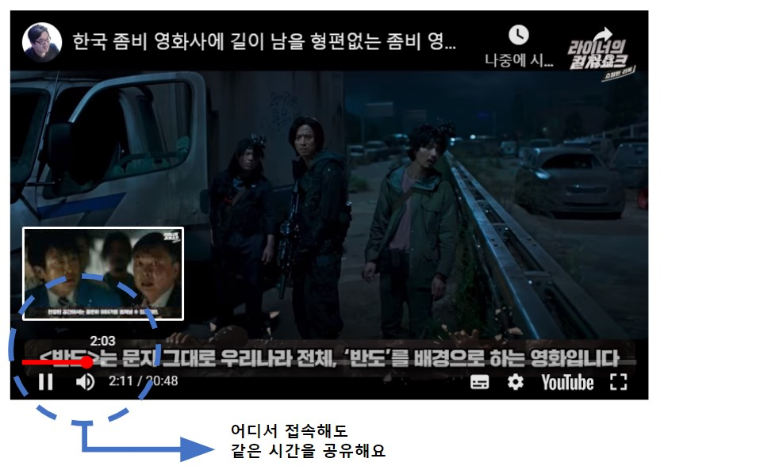
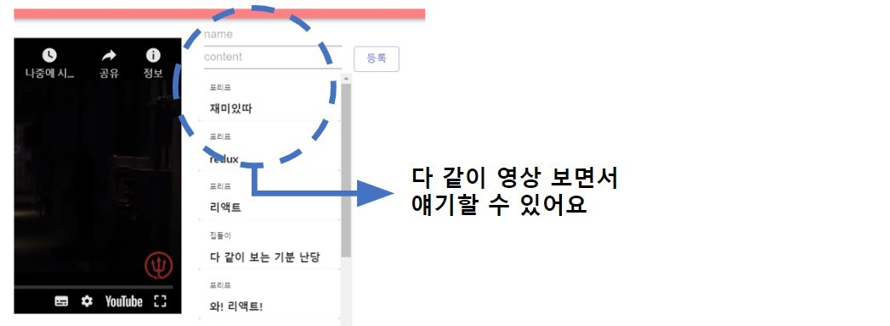
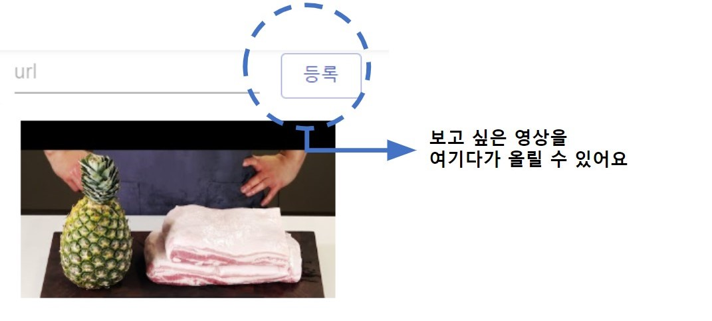

# Youtube Together

## Demo
http://youtube-together-bbkmx.run.goorm.io/

## ScreenShot

## Refs
- JS
    - Async, Promise    
    https://jeong-pro.tistory.com/128
- React
    - props, state    
    https://velopert.com/3629
    - binding concept    
    https://devlog.jwgo.kr/2018/08/20/set-state-undefined-error-in-react/
    https://jeong-pro.tistory.com/79
    - webpack error    
    https://codingmania.tistory.com/331
- Youtube    
https://github.com/tjallingt/react-youtube
- Server    
https://m.blog.naver.com/sejun3278/221569553363
- MYSQL Timestamp    
    https://m.blog.naver.com/PostView.nhn?blogId=cherish1058&logNo=220593963223&proxyReferer=https:%2F%2Fwww.google.com%2F
